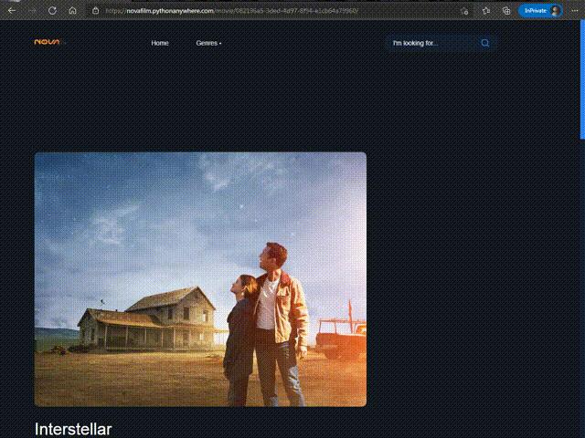

# NovaFilm
A django movie website.
My Live Demo : http://novafilm.pythonanywhere.com/

> Updated ! 
> Login, Register and Profile system added

# Plans
- [x] Login, Register and Profile system
- [x] REST APIs

# How to run?
1. git clone https:///Impulse-Code/django-movie-site.git 
2. cd django-movie-site 
3. python3 manage.py createsuperuser 
**Enter your username and password** 
4. python3 manage.py runserver 
**open 127.0.0.1:8000 in your browser** 
5. Admin Panel : 127.0.0.1:8000/admin 
**Enter your username and password** 
6. Now you can post movies and series

----------------------------------------------

# Preview

# Impulse-Code
